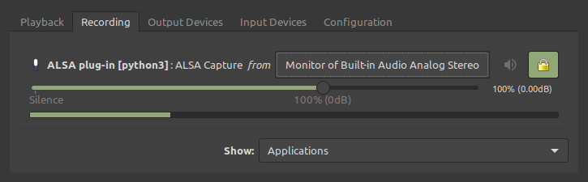

# brownies

If you accidentally ran this on Linux, while your favorite music streaming app was playing, it might take control of your player and record its output, song-by-song, skipping songs that already exist, and embedding ID3 metadata. That would be really bad. Strongly discouraged.

Why would anyone want to do such a terrible thing? Well, some people like listening to music when they drive, and their car has a USB port and hands-free interface dedicated to playing MP3s off a flash drive, and they prefer to leave their phone in their pocket.

### Requirements

Ubuntu packages:

```
$ sudo apt install python3 \
python3-dev \
virtualenv \
portaudio19-dev \
ffmpeg \
libavcodec-extra
```

From your favorite music streaming service:

- A developer account and application. The application will have a client ID and secret.
- A refresh token. [Here’s an example for generating one](https://github.com/danrashid/brownies/tree/master/docs).

### Recommendations

- pavucontrol (Ubuntu package) for selecting your monitor channel for input. Or you can [try to do it manually](https://wiki.archlinux.org/index.php/PulseAudio/Examples#ALSA_monitor_source). While `main.py` is running, successful capturing looks like this in pavucontrol:
  

### One-time setup

Create and activate your virtualenv, then:

```
$ pip3 install -r requirements.txt
```

### Usage

Activate your virtualenv, then:

```
$ ./main.py --help
```
